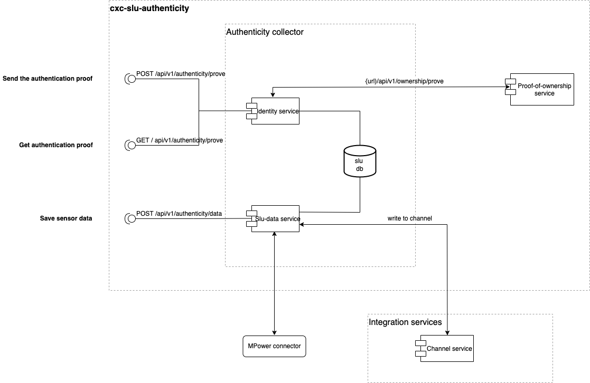

## Description

Authenticity Collector is a microservice that saves the authentication proof of the devices of CityXChange. Furthermore it writes the sensor data, which is send by the device, to his own channel and sends it also to MPower.

<p align="center">
  
</p>

## Installation

CD to the authenticity-collector directory and install by running:

```bash
$ npm install
$ npm run build
```

Copy .env.example and change it's name to .env. After that provide values for the variables inside it accordingly.

Here is an example what a correct .evn file should look like:

```bash
DATABASE_URL=mongodb://localhost:27017/?readPreference=primary&appname=MongoDB%20Compass&directConnection=true&ssl=false
DATABASE_NAME=slu

PROVE_OF_OWNERSHIP_URL=http://ssi-proof-of-ownership:3033/api/v1/ownership/prove

PORT=3066

IS_API_KEY=94F5BA49-12A6-4E45-A487-BF91C442276D
IS_API_URL=http://localhost:3033

AUTH_PROVE_EXPIRATION=120000

COLLECTOR_DID=did:iota:6RnvLnEvMnAEDNj8668D9oJUdJ4MpTnicgiMZX1vck9i
COLLECTOR_SECRET=GDGkoGeZxXF9Cer9VezR2L4t5df4jZ4wACCoxXrzdvNZ

MPOWER_CONNECTOR_URL=https://en5mzd9ir2abq.x.pipedream.net/
```

## Running the app

```bash
$ npm run start
```

## Using the Authenticity-Collector microservice

For using the service you need to create an identity for the collector so it is possible to create and write to his own channel. Then you need to provide the id and the secret for COLLECTOR_DID and COLLECTOR_SECRET of the identity in the .env file of the docker-compose.yml. To create the collector identity you need to install the `integration-services cli`:

```
$ npm install -g @iota/is-cli@latest
  is help
```

and follow the package documentation to configure and create the collector identity.

On startup of the service it checks if the id and secret is provided and if the service has already one channel. If there is no channel it will automatically create one.

We have two different endpoints:

1. The `identity service` has two methods:

- `POST /api/v1/authenticity/prove` - to send the authentication proof of the device

- `GET /api/v1/authenticity/prove` - to get the database entries between a timeframe by providing query with "id","from" and "to"

2. The `sludata service` has one method:

- `POST /api/v1/authenticity/data` - to write the sensor data to the collector channel and sending it to MPower
