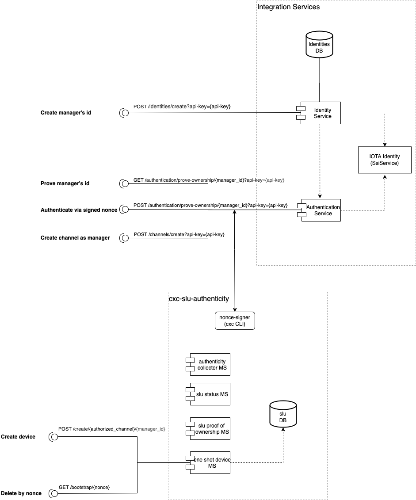

## Description

One-Shot-Device is a microservice that allows the creator to register and authenticate devices for the CityXChange. It uses Integration Services and IOTA SSI.

<p align="center">
  
</p>

## Installation

CD to the one-shot-device directory and install by running:

```bash
$ npm install
```

Copy .env.example and change it's name to .env. After that provide values for the variables inside it accordingly.

Here is an example what a correct .evn file should look like:

```bash
MONGO_URL="mongodb://localhost:27017/?readPreference=primary&appname=MongoDB%20Compass&directConnection=true&ssl=false"
DB_NAME=slu

IS_API_KEY=94F5BA49-12A6-4E45-A487-BF91C442276D
IS_API_URL=http://localhost:3033

SLU_STATUS_URL=http://localhost:3000
SLU_STATUS_API_KEY=94F5BA49-12A6-4E45-A487-BF91C442276D

PORT=8088
```

## Running the app

```bash
$ npm run start
```

## Using the One-Shot-Device microservice

<br>

`Using Postman`

First import the Postman collection located in the `one-shot-device/postman collection`. To do that open the `File` menu, then `Import` and navigate to the microservice directory and choose `authorize-device-to-channel.postman_collection.json` and click `Import`. Make sure you provide values for the variables accordingly:

- `one-shot-device-url`: base url to the one-shot device microservice, i.e: `http://localhost:8080/api/v1/one-shot-device`
- `api-key`: you can use the following the API key: `94F5BA49-12A6-4E45-A487-BF91C442276D`
- `is-url`: base url for the Integration Services microservice, i.e: `localhost:3099/api/v0.1`

Once it is done, follow these steps to create a channel and register the device:

1. In the `Identities` tab:
   Click the `Create managers id` and send the POST request, it its response look for the value `id` and copy it into the collection variable called `manager_id`. You need to also securely store the value of `secret` to be used in the next step.

2. In the `Authentication` tab:
   Click on the `Prove manager's id` and sent the GET request. It returns you a nonce that you will need to sign. To sign the nonce, in the terminal navigate to the `nonce-signer` folder:

   ```bash
    $ cd nonce-signer
   ```

   There run the following commands:

   ```bash
   $ npm install
   $ npm run start
   ```

   Then provide the nonce and secret you have securely stored and hit enter to have the nonce signed. Again, store its value in the collection variables in the respective field.

   Now click on the `Authenticate via signed nonce` and in its Body tab change the value of "signedNonce" to the one that you have just signed with nonce-signer and send the GET request. The request returns a jwt token that you then store in the collection variables like with other values.

3. In the `Channels` tab:
   Click on the `Crate channel as manager` and copy the returned channel value into the `authorized_channel` value field in the collection variables - remember that to add the suffix `Bearer` in the variable value.

4. With the steps above, you can now create and update device status in the `One Shot Device Actions`:

- To create a new device click on the `Create Device` and send the POST request. In its response look for the nonce and save it in the collection variables
- To install a new device and change its status to 'installed' click on the `Delete by nonce`
